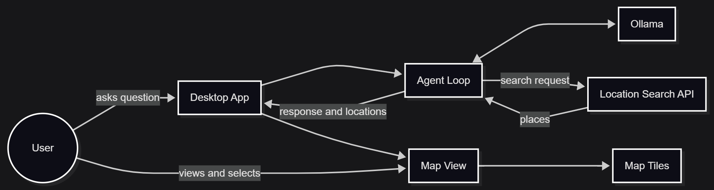

# Nika Location Agent

Local-first desktop AI agent for Singapore location discovery.

## What This Is

This project is a Tauri v2 desktop app with a React + TypeScript frontend. It uses a local Ollama model to act as an agent, calls a `location_search` tool backed by Nominatim, and renders results on a deck.gl map with MapLibre tiles.

The current implementation focuses on the end-to-end agent loop, typed data flow, and a clear structure that is easy to explain in an interview.

## Architecture



The image above shows the high-level flow of the app from the user, through the desktop shell and agent loop, to Ollama, the location search service, and the map view.

1. The chat panel accepts a natural-language location query.
2. `src/App.tsx` sends the conversation into the agent loop.
3. `src/lib/ollama.ts` talks to the local Ollama HTTP API and checks that Ollama is reachable.
4. `src/lib/agent.ts` runs the tool-calling loop and handles assistant/tool messages.
5. `src/lib/tools.ts` defines the tool registry and executes `location_search`.
6. `src/lib/locationSearch.ts` calls Nominatim and converts results into typed location records and GeoJSON features.
7. `src/components/MapPanel.tsx` renders the results with deck.gl and MapLibre.
8. `src/components/ChatPanel.tsx` shows the conversation history and prompt input.

## Project Structure

- `src/main.tsx` boots React and loads the global styles.
- `src/App.tsx` owns the main application state for chat, map results, and Ollama readiness.
- `src/components/ChatPanel.tsx` renders the chat UI.
- `src/components/MapPanel.tsx` renders the map and selected location details.
- `src/lib/agent.ts` contains the agent turn orchestration.
- `src/lib/ollama.ts` contains the Ollama client, model config, and error handling.
- `src/lib/tools.ts` defines and executes tools.
- `src/lib/locationSearch.ts` fetches Nominatim results and converts them to typed data.
- `src/lib/geo.ts` computes map view state from returned locations.
- `src/types.ts` holds the shared TypeScript types.
- `src-tauri/` contains the Tauri Rust shell and config.

## Model Choice

The default model is `qwen2.5:7b`. I switched to the 7B model because the 14B model required more memory than this machine had available. The app includes clearer error handling for low-memory Ollama failures.

If your machine has more memory, you can change the model in `src/lib/ollama.ts` to `qwen2.5:14b`.

## Run Locally

1. Install Ollama.
2. Pull the model:

   ```bash
   ollama pull qwen2.5:7b
   ```

3. Start Ollama:

   ```bash
   ollama serve
   ```

4. Install dependencies:

   ```bash
   npm install
   ```

5. Launch the desktop app:

   ```bash
   cargo tauri dev
   ```

## Current Status

- The frontend builds successfully.
- The Tauri backend compiles successfully.
- The app launches with a chat panel and a deck.gl map.
- Ollama health checks are built in, so missing server/model issues produce a clearer message.
- End-to-end testing still depends on Ollama being installed, running, and the `qwen2.5:7b` model being pulled.

## Known Limitations

- Streaming output is not implemented yet.
- Only one tool is wired right now: `location_search`.
- Nominatim requests are made directly from the frontend, which is simple but could be moved behind a Tauri command later.
- Map styling is intentionally minimal so the focus stays on the agent loop and data flow.

## Useful Commands

```bash
npm run dev
cargo tauri dev
npm run build
cargo build --manifest-path src-tauri/Cargo.toml
```
