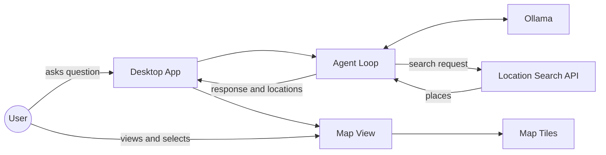

```mermaid
flowchart LR
  User((User))
  App[Desktop App]
  Agent[Agent Loop]
  LLM[Ollama]
  Geo[Location Search API]
  Map[Map View]
  Tiles[Map Tiles]

  User -->|asks question| App
  App --> Agent
  Agent <--> LLM
  Agent -->|search request| Geo
  Geo -->|places| Agent
  Agent -->|response and locations| App
  App --> Map
  Map --> Tiles
  User -->|views and selects| Map
```
